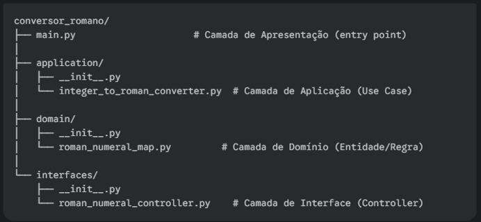

## Python-conversor-romano
Este repositório contém um codigo python que segue os padrões de POO e Clean arqtecture. Seu objetivo é receber um algarismo natural e convertelo para números romanos.

## Estrutura do projeto
Abaixo uma breve descrição de como este projeto simples foi estruturado:

## 1. Camada de Domínio (Domain)
Esta camada conterá a regra de negócio mais fundamental: o mapeamento entre os números e os símbolos romanos.

## 2. Camada de Aplicação (Application)
Aqui fica o caso de uso: "Converter um inteiro para um numeral romano". Ele usa a regra da camada de domínio para executar sua tarefa.

## 3. Camada de Interfaces (Interface Adapters)
Esta camada age como um "adaptador". Ela recebe dados brutos do mundo exterior (neste caso, um texto do usuário), valida esses dados, os converte para um formato que o caso de uso entenda (um int), chama o caso de uso e, finalmente, formata a resposta para o usuário.

## 4. Camada de Apresentação (Frameworks/Drivers)
Esta é a camada mais externa. É o ponto de entrada da aplicação que interage diretamente com o usuário. Neste exemplo, será um simples loop de linha de comando (CLI).

## Caso de uso
Este exemplo mostra como o programa funciona.

Entrada dos dados
![!\[Texto alternativo para a imagem\] ](image/image.png)

Resultado esperado
